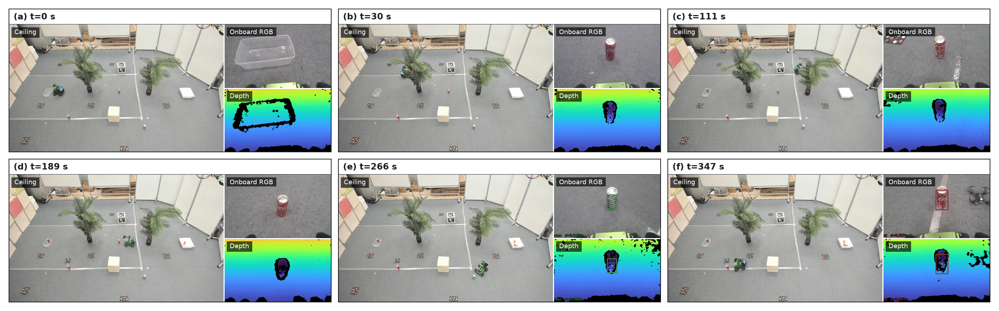

# JetRover 无人机—小车协同抓取系统

无人机报出饮料罐坐标 → LLM 决定下一个动作 → 麦轮小车导航到罐子前的 standoff 点 →
深度相机识别 + 机械臂抓取 → 送到垃圾站 → 循环。

平台：JetRover 麦轮底盘（Jetson Nano，ROS Noetic）+ 深度相机 + 5 自由度机械臂 + RPLidar，
本机 Ubuntu 20.04 跑规划、可视化和视频生产。

真机最好成绩：**五罐闭环 5/5 零干预，6 分 12 秒**（2026-08-08 夜，双站"窄门"布局）。
后续多次复现 5/5，含一趟按无人机发现顺序动态规划的。

> 英文版说明见 [README.md](README.md)。



*一趟完整的五罐闭环（2026-08-15）。每格左边是天花板机位，右上是车载 RGB，右下是深度伪彩。
布局是 `free` 模式：四红一绿共五罐、两个收集站，送哪个站由 LLM 每趟现挑。
(a) 出发，夹爪对着空收集箱；(b)(c)(d) 前三罐进入甜点区；(e) 绿罐；(f) 最后一罐，画面右侧能看到报坐标的无人机。*

---

## 跑起来

### 没有车也能试（五分钟）

规划 + LLM 决策层**只依赖 PyYAML**，不用 ROS、不用硬件：

```bash
pip install PyYAML
ollama pull qwen3:8b            # 本地模型，这个项目里没有云、没有 API key
cd code/planning

python3 plan_next.py --state ../../run_data/mission_state_0816a.yaml --no-llm   # 只跑几何门
python3 plan_next.py --state ../../run_data/mission_state_0816a.yaml           # 几何门 + LLM
```

那个 state 是真实录的布局。预期输出：五个罐子里**只有 can3 过得了几何门**，另外四个
会被报成"被 can3 挡住"并给出净空。然后那四个**根本不会出现在给 LLM 的 enum 里**——
分层安全边界那条性质，一条命令就能看到。

`mission_sim.py` 更进一步：拿真实录的坐标回放几种局面，车全程不用开机。

### 上真机

⚠️ **这个仓库是归档，不是装好的包。** 目录分层是**为了读**，所有脚本互相调用写的都是
`~/foo.py`，所以 clone 完什么都跑不起来，必须先把文件铺回家目录：

```bash
cp jetrover_env.example ~/.jetrover_env && chmod 600 ~/.jetrover_env   # 填自己的车 IP
bash tools/deploy.sh            # 演练：只打印会写哪些文件，不落盘
bash tools/deploy.sh --apply    # 真铺到本机 ~/ 和车上 ~/
bash ~/jetrover_up.sh           # 开工七步体检，不过就停，绝不动车
```

`deploy.sh` 覆盖前一律备份；**默认不铺现场标定**（航点、IMU 零偏必须重测，不是能拷贝的东西）；
而且**车上文件比仓库新时会直接停下**，并打印把它拉回仓库的命令——车才是车上代码的真值来源。

`jetrover_up.sh` 把"连车 → 抓取栈 → cmd_vel 桥接 → 只读体检 →
雷达 → 导航栈 → 清旧点"固化成带判据的七步，省掉跑完一整趟才发现白跑。

分层设计、各模块的关键参数与实测数字、已知失败模式与处置见
**[`docs/TECH_DESIGN.zh.md`](docs/TECH_DESIGN.zh.md)**；依赖分层见 [`requirements.txt`](requirements.txt)；
换电脑 / 换车 / 换机器人见 **[`docs/PORTING.md`](docs/PORTING.md)**；
录像怎么录、多机位怎么对齐、上帝视角怎么离线重渲染见
**[`docs/VIDEO_PRODUCTION.md`](docs/VIDEO_PRODUCTION.md)**。

---

## 系统怎么跑

```
无人机 / drone_sim.py            [本机]  逐条报出罐子 x/y
        ↓ drone_feed.jsonl
   plan_next.py                  [本机]  读任务记忆 → 造候选 → LLM 挑下一个动作
        ↓ 只输出动作名，绝不输出坐标（分层安全边界）
   mission_run.py                [本机]  主循环，ssh 驱动车执行 + 回写记忆
        ↓ ssh
   nav_goto.py → rotate_to.py    [车上]  rotate-then-go 导航到 standoff 点
        ↓
   approach.py                   [车上]  纯平移把罐子送进抓取甜点区
        ↓
   final_track_and_grab_y0.py    [车上]  深度相机识别 + IK + 夹爪，抓起来送站
```

安全层不在 LLM 里：`plan_clearance.py` 向 `move_base` 要**真实全局路径**，
算这条腿会不会从别的罐子旁边太近掠过（罐子矮，雷达扫不到，costmap 里根本没有它们）。

---

## 目录

| 路径 | 内容 |
|---|---|
| `code/grasp/` | 抓取 + 导航主力。**绝大多数跑在车上**，本机这份是同步副本（整理时逐个 md5 比对过：53 个同名文件里 50 个与车上一致） |
| `code/planning/` | 任务规划、LLM 决策、离线仿真。跑在本机 |
| `code/demo_tools/` | rviz 上帝视角、离线重渲染、录屏、修片。跑在本机。方法见 [`docs/VIDEO_PRODUCTION.md`](docs/VIDEO_PRODUCTION.md) |
| `code/demo_scripts/` | 多视角合成、检测框叠加、论文定性图 |
| `code/ops/` | 开工起栈脚本 |
| `code/car/` | 只跑在车上、本机没有副本的那部分：起栈脚本、导航/EKF 配置、IMU 去偏、录好的航点 |
| `run_data/` | 任务状态 yaml、地图 pgm、路径 jsonl、每趟的日志 |
| `figures/` | 论文定性序列图 + 排查对比图 |
| `deliverables/` | 作品集 HTML、teaser deck |

---

## 文件索引：按复用价值分层

### ⭐ 一等：换个机器人也用得上的方法

这一层是最值得回头读的——解决的是**通用问题**，不绑这台车。

| 文件 | 位置 | 解决什么问题 |
|---|---|---|
| `car/imu_debias.py` | 车上 | IMU 零偏在线估计后再喂 EKF。零偏会温漂（15 分钟变 15%），**必须每次现测，不能硬编码**——这条结论比代码值钱 |
| `car/cmd_odom.py` | 车上 | 把"指令速度"当一路里程计喂 EKF。没有轮式里程计时的补位方案 |
| `grasp/rotate_to.py` | 车上 | 用 TF 反馈原地转到目标 yaw。破 DWA 掉头摆死的病根 |
| `grasp/plan_clearance.py` | 车上 | 向 `move_base/make_plan` 要**真实**路径算净空。直线模型会高估 56%、最大差 0.35m，别拿直线当安全依据 |
| `grasp/collect_paths.py` | 车上 | 批量存 make_plan 整条折线（132 条腿 3.3 秒，车不动），离线分析的数据源 |
| `grasp/scan_probe.py` | 车上 | 发运动指令**之前**先看一眼车周围有什么。廉价的事前拦截 |
| `demo_tools/demo_markers.py` + `pub_map.py` | 本机 | 录了 rosbag 就能**事后**把罐子/站/几何门状态叠进 rviz 重渲染，不用重拍 |
| `demo_tools/fix_truncated_mp4.py` | 本机 | 修硬掉电截断的 H.264 mp4（缺 moov）。从好文件取 SPS/PPS、mdat 转 Annex-B 重封装，实测 10333 帧全回来 |
| `planning/plan_next.py` | 本机 | LLM 决策的**分层安全边界**设计：LLM 只输出动作名，永不输出坐标。694 行，含 prompt 工程的踩坑注释 |

### 二等：本项目主线（要复现这套系统就靠它们）

| 文件 | 位置 | 作用 |
|---|---|---|
| `planning/mission_run.py` | 本机 | 主循环：收坐标 → 叫 LLM → 驱动车收一个罐子 → 回写记忆。456 行，支持 `--interruptible` / `--record` / `--dry-run` |
| `grasp/approach.py` | 车上 | 逼近环：导航到位后用纯平移把罐子送进甜点区。434 行 |
| `grasp/final_track_and_grab_y0.py` | 车上 | 抓取执行主体。754 行，**派生自幻尔厂商出厂例程**（原版不随本仓库分发，见 `NOTICE.md`） |
| `grasp/nav_goto.py` | 车上 | rotate-then-go 导航封装 |
| `grasp/set_place.py` / `record_point.py` / `record_place_once.py` | 车上 | 录点 / 写点到 `llm_nav_places.yaml`。落盘后**回读确认**（静默失败 + 乐观提示是最坏组合） |
| `grasp/teach_place.py` | 车上 | 手把手教"投篮"放置姿势 |
| `grasp/grab_depth.py` | 车上 | 纯深度凸起抓取（不看颜色）：RANSAC 拟合桌面 → 桌面以上连通块 = 物体。**夜间户外罐子没色度时的备胎路线** |
| `ops/jetrover_up.sh` | 本机 | 开工七步体检 |

### 三等：诊断与测量工具（一次性用途，但方法学最该学）

这一组是"**别死磕调参，先把现象量出来**"的产物。每个都在回答一个具体的物理问题。

| 文件 | 回答什么问题 |
|---|---|
| `grasp/drift_check.py` | 原地旋转到底会不会让 hector 的位置估计滑移？（⚠️**它会让车原地转一圈**，跑之前想清楚） |
| `grasp/wobble_check.py` | 导航时车头"一扭一扭"到底有多扭？（量变号次数，带死区免得把噪声算成扭） |
| `grasp/yaw_check.py` | "车头朝向"这一维到底有多脏？ |
| `grasp/straight_scaling.py` | 直行偏航是"按米累积"还是"每次起停固定踢一下"？→ 结论：**不存在"每米歪多少"，别去标定电机** |
| `grasp/drive_check.py` | 直行时"扭"的三个候选病因，分开验 |
| `grasp/obstacle_check.py` | 同一场地同一目标，换规划器跑两遍做对照 → TEB 换掉 DWA 的依据 |
| `grasp/odom_drytest.py` | 干测 cmd_odom → EKF 的位移通路 |
| `grasp/path_deviation.py` | TEB 实际轨迹偏离全局路径多少？→ 实测最大 0.166m，告警线 0.50 才有余量 |
| `grasp/capture_one.py` / `jitter_check.py` | 摆好罐子后先验检测：ROI 框住的到底是不是罐子、框心跳不跳。**录点成功 ≠ 抓得住** |
| `grasp/analyze_scene2.py` | 离线设计深度凸起抓取（RANSAC 平面分割），配 `scene_*.npy` 样本数据可直接跑 |
| `grasp/read_servos.py` / `check_place_row.py` / `probe_place.py` | 只读体检：舵机位置、落点 IK 可达性 |
| `planning/clearance_scan.py` | 跑前全布局净空扫描 |
| `planning/mission_sim.py` | 离线回放真实坐标，造几种局面测 `plan_next.py`（不用开车） |
| `planning/scene_search.py` / `two_station_gap.py` | 搜"能让贪心吃亏"的布局 / 算加第二个站带来多大优化空间 |
| `planning/mission_review.py` | 跑完复盘 |

### 四等：Demo 生产线

| 文件 | 作用 |
|---|---|
| `grasp/record_cam.py` | 车上录 RGB + 深度伪彩成视频（H.264 直出） |
| `demo_tools/start_rviz_virtual.sh` | rviz 关进 Xvfb 虚拟屏再录，桌面窗口盖不上去 |
| `demo_tools/rec_rviz.sh` | 录屏 |
| `demo_tools/replay_*.sh` + `render_*_rviz_dynamic.sh` | 离线重放 bag + 重渲染上帝视角（每趟一份） |
| `demo_scripts/compose/make_*view_*.sh` | 多视角合成（五宫格 / 六宫格） |
| `demo_scripts/overlays/` | 无人机检测框叠加 |
| `demo_scripts/figures/` | 论文定性序列图 |
| `demo_tools/*.rviz` | rviz 布局。⚠️`Scale` 就是 px/m，**每换一张地图必须重设 X/Y/Scale**；历次拍摄的旧布局在 `rviz_archive/` |

### 五等：归档，别删但也别当主力

- `grasp/colleague_final_grab/` — 围绕厂商例程的启动封装、中文使用说明、现场标定的颜色阈值（**厂商源码本身不在这里**，见 `NOTICE.md`）
- `grasp/*.bak_*` — 早于 git 的历史版本，git 恢复不了，所以留着
- `demo_scripts/archive/`、`demo_tools/rviz_archive/` — 旧版本

---

## 环境与配置

车 IP / 本机 IP 全部走 `~/.jetrover_env`（不进 git）：

```bash
cp jetrover_env.example ~/.jetrover_env && chmod 600 ~/.jetrover_env
```

DHCP 换了 IP 只改这一个文件。命令行临时覆盖仍然优先：`CAR_IP=10.0.0.5 bash code/ops/jetrover_up.sh`。

车上必须显式 `export MACHINE_TYPE=JetRover_Mecanum`，否则底盘类型认错。

---

## 车上代码的边界

`code/car/` 里是**只跑在车上、本机没有副本**的那部分（已拉回，15 个文件）：

| 文件 | 作用 |
|---|---|
| `align_check.py` | 在线漂移体检：scan-to-map 对齐。判据"中位 > 0.05m 就停"。**只读，不动车** |
| `standoff_wall_check.py` | 量 standoff 点离墙多远。< 0.35m 必须换摆位，重试救不回来 |
| `imu_debias.py` / `imu_bias.yaml` | IMU 零偏在线估计。零偏温漂，必须每次现测 |
| `cmd_odom.py` / `ekf.yaml` | 指令速度当里程计喂 EKF（这车没有轮式里程计） |
| `cmd_vel_to_motor.py` | `/cmd_vel` → 麦轮电机。导航栈的最后一环 |
| `llm_nav_commander.py` | 车上侧的导航命令接收端 |
| `nav_teb_holo.launch` | **现行导航配置**：TEB + 麦轮横移。换掉 DWA 的那一版 |
| `nav_hector_bfc.launch` | 建图配置。⚠️`map_update_angle_thresh=0.06`（转 3.4° 就重写地图，上游默认 51°），怀疑是"炸图"的雪崩放大器，**未验证** |
| `nav_hector_ekf.launch` | hector + EKF 版。⚠️默认 `use_teb=false`，直接用会退回 DWA |
| `start_board.sh` / `start_lidar.sh` / `start_nav.sh` | 起栈脚本，被 `ops/jetrover_up.sh` 通过 ssh 调用 |
| `llm_nav_places.yaml` | 录好的航点（standoff 点 + 垃圾站） |

**故意没拉的**：`ros_car/`、`ros1_ws/`、`JetRover-Jetson_nano_ros1/ros_ws/` 三个 ROS
工作区。里面绝大部分是幻尔出厂包和第三方开源包，不是本项目产出，见 `NOTICE.md`。

---

## 许可

本仓库自有代码按 MIT 发布（见 `LICENSE`）。
`final_track_and_grab_y0.py` 派生自幻尔 JetRover 出厂例程，厂商原版不随本仓库分发——
第三方代码与数据的完整说明见 **`NOTICE.md`**。
